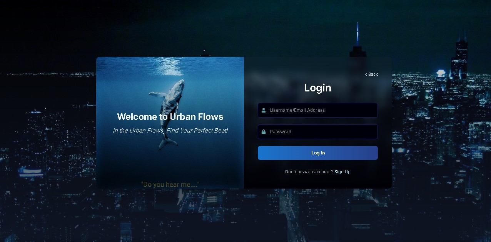
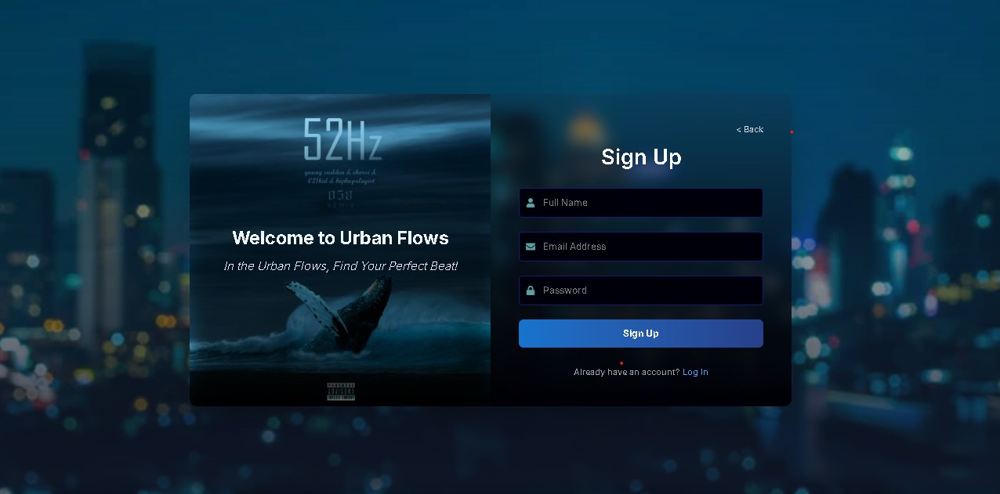
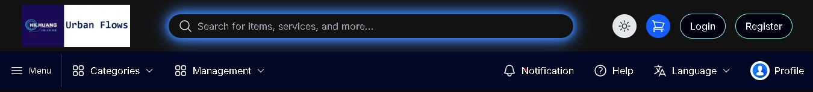
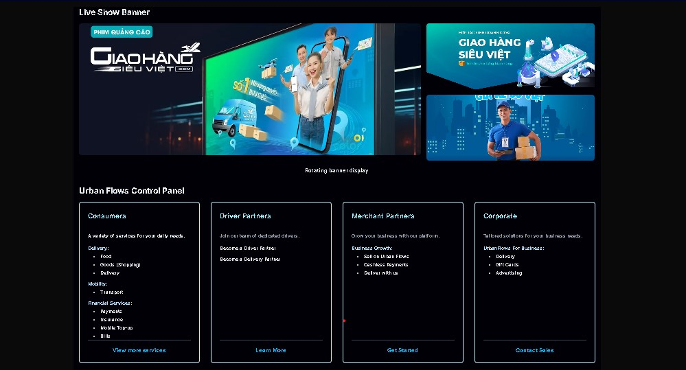
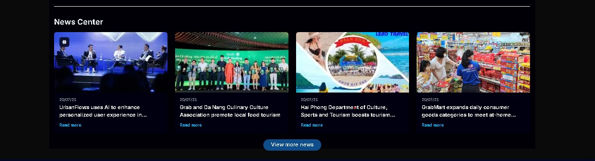
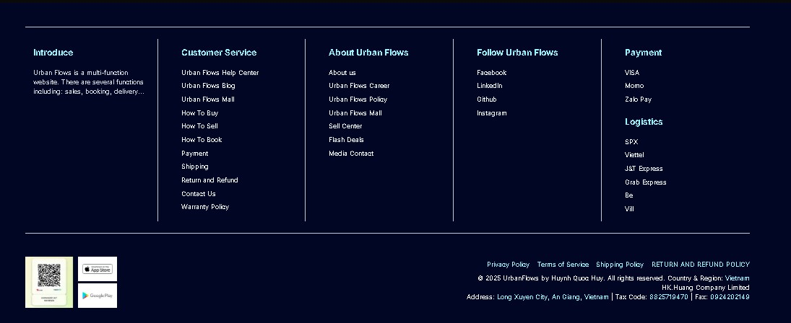
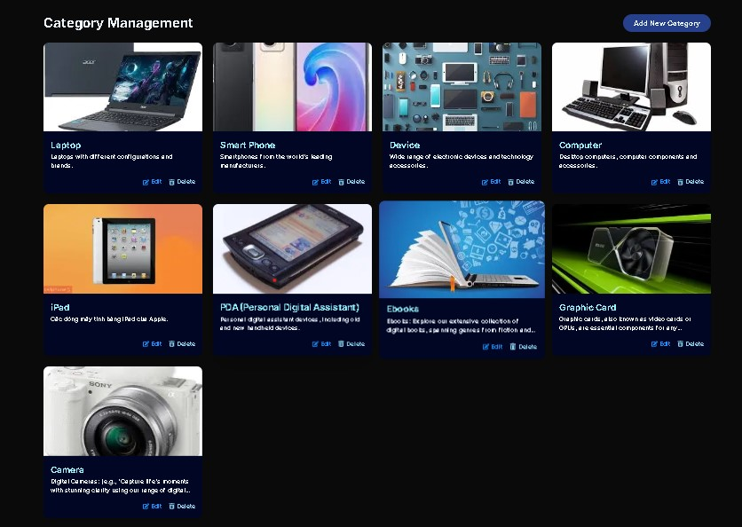

# Urban-Flows

**Urban-Flows** is a comprehensive e-commerce and news platform built with the MERN stack and Next.js, designed to provide a seamless urban experience. From finding the latest news and trends to purchasing goods and booking rides, Urban-Flows brings all your urban needs into one integrated platform.

## Demo
### Authentication Pages

  
   
  <em>Log In Form</em>

  
   
  <em>Sign In Form</em>

---
### Web Page View

  
  
  
  
   
  <em>Website Demo</em>

### Categories Management

  
   
  <em>Categories Management</em>

## Features

-   **E-commerce & News Integration**: A unique blend of an e-commerce platform and a news portal, allowing users to stay informed while they shop.
-   **Shopping & Purchasing**: Users can browse and purchase a wide variety of items.
-   **Delivery Management**: Integrated delivery and shipping functionality to manage the order fulfillment process.
-   **Ride Booking**: A feature for booking transportation, making urban mobility effortless.
-   **Comprehensive Admin Panel**: A robust management system for:
    -   **Categories & Items**: Organize and manage product categories and inventory.
    -   **Accounts**: User and admin account management.
    -   **Orders & Order Items**: Track and manage customer orders.
    -   **Content Management**: Manage topics and articles for the news section.
    -   **Shipper Management**: Manage shipper profiles and delivery requests.
    -   **Booking Management**: Handle all ride booking requests and details.

---

## Technologies

### Backend

The backend is a RESTful API built with **Node.js** and **Express.js**. It uses **MongoDB Atlas** for a scalable, cloud-hosted database.

**Key Libraries**:
-   `cors`: For enabling Cross-Origin Resource Sharing.
-   `mongoose`: To provide an elegant and robust schema-based solution for modeling your application data.
-   `jsonwebtoken`: For secure, token-based user authentication.
-   `multer`: For handling file uploads (e.g., product images).
-   `path`: For working with file and directory paths.
-   `dotenv`: To manage environment variables securely.

The backend server runs on `port: 3001`.

### Frontend

The frontend is a dynamic and responsive web application crafted with **React.js** and **Next.js**. The design leverages popular UI libraries to achieve a beautiful and modern user experience.

**Key Libraries**:
-   `React.js`: A JavaScript library for building user interfaces.
-   `Next.js`: A React framework for production, providing server-side rendering and static site generation.
-   `Tailwind CSS`: A utility-first CSS framework for building custom designs rapidly.
-   `Bootstrap`: A powerful, feature-packed front-end toolkit.
-   `jQuery`: For simplifying DOM manipulation and event handling.

The frontend application runs on `port: 3000`.